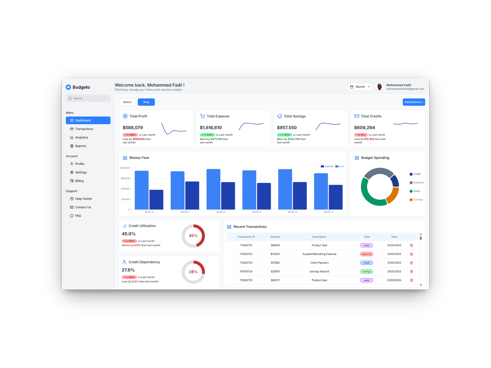
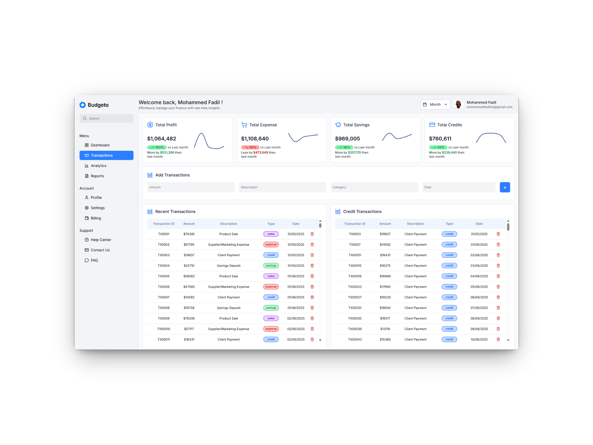
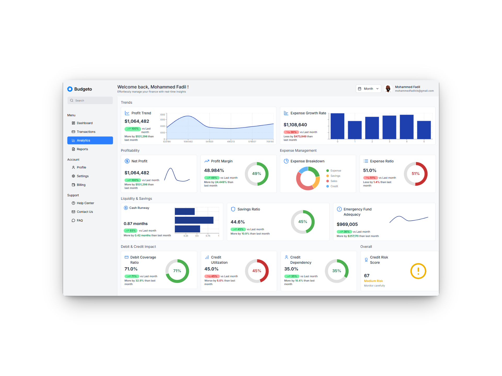

# Budgeto

A business analytics dashboard to analyze **profit, sales, expenses, savings and credits** and quickly see **how well a business is doing** or **if it’s going into danger**.

## Tech Stack
- **Frontend:** React + TailwindCSS
- **Backend:** Spring Boot
- **Database:** H2

## Repository Structure
```
/backend      # Spring Boot app
/frontend     # React app
/data         # SQL files you will import into H2
```

## Images

### Dashboard


### Transaction


### Analytics

---

## How to Run (Do this in order)

### 1) Start the Backend (Spring Boot + H2)
- Go to the backend folder and run the Spring Boot app (use Maven or your IDE).
- Open the H2 console in the browser (usually `http://localhost:8080/h2-console`).
- Use the JDBC URL/User/Password configured in `backend` (check `application.properties` if needed).

### 2) **Create Base Records in H2 (MANDATORY)**
Create **one user** and **at least one business** before importing data.
Run these in the H2 console:

```sql
INSERT INTO userss (id, location, email, name)
VALUES
(1, 'New York', 'alice@example.com', 'Alice');

INSERT INTO business (id, name, category, location, user_id)
VALUES
(1, 'Alice''s Bakery', 'Food', 'Manhattan', 1);
```

> ⚠️ If you skip this step, the frontend will error. The frontend expects a user and a business to exist.

### 3) **Load Data from `/data` SQL files (REQUIRED)**
- After the user + business exist, import the SQL files from the `/data` folder into H2.
- This will populate **transactions, sales, expenses, credits**, etc.
- **Do not** hardcode example inserts for expenses; **use the SQL files from `/data`**.

Bad example (don’t rely on this; use the data files instead):
```sql
INSERT INTO expense (ID, AMOUNT, DATE, DESCRIPTION, TYPE, BUSINESS_ID) VALUES
(1, 120.50, '2025-06-01', 'Grocery shopping', 'expense', 1);
```

### 4) Start the Frontend (React + Tailwind)
```
cd frontend
npm install
npm start
```

---
## Improvements Needed

### Month Filtering
- **Current behavior:** Month selection is a dummy placeholder and doesn’t actually filter data.  
- **To do:** Implement a proper month selector in the UI and map it into the API calls so that filtering by month works as expected.  

### Yearly Sales Calculation
- **Current issue:** Any part that requires calculations based on yearly quantity is not implemented.  
- **To do:** Create a new custom query + DTO for year-wise aggregation on the backend, and connect it to the frontend for correct yearly sales reporting.

### Exception Handling
- Improve error handling and data validation when fetching from the API.  
- Ensure the frontend checks if data is available before rendering; if not, show a proper fallback (e.g., loading state, error message, or default values) instead of breaking. This ensures frontend loads even if data is not present on backend.
---

## Quick Troubleshooting
- **Frontend errors on empty data** → Make sure you created a user + business and imported `/data/*.sql` first.
- **H2 login issues** → Check `backend/src/main/resources/application.properties` for the exact H2 JDBC URL and credentials.


---

Made with React, TailwindCSS, Spring Boot and H2.
